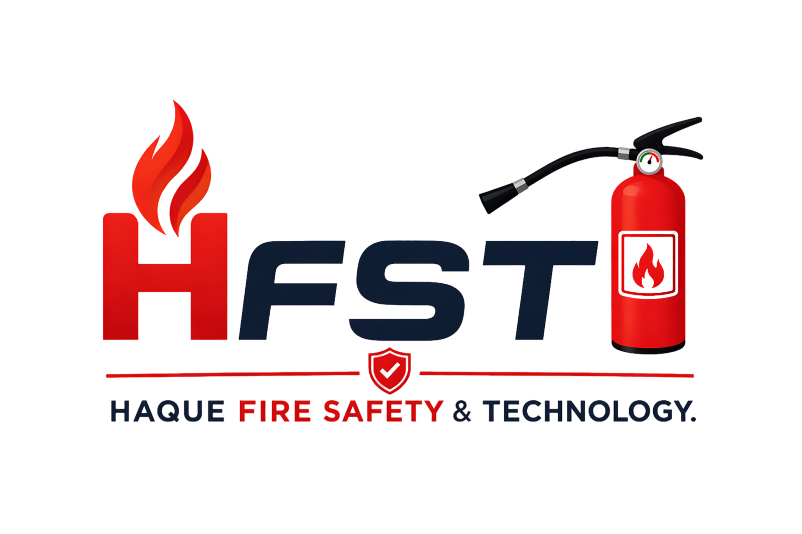

# 🌙 Eid Fire Safety Checklist | HFST

<div align="center">
  
  <p><strong>A pre-departure guide for every family heading to their village home (গ্রামের বাড়ি).</strong></p>
</div>


## 📌 About The Project

Every year in Bangladesh, fire incidents spike during Eid holidays due to empty homes, unattended appliances, and open gas lines. A single overlooked switch can turn joy into tragedy. 

This **Eid Fire Safety Checklist** is a modern, interactive web application developed for **Haque Fire Safety & Technology (HFST)**. It provides a simple, interactive 2-minute checklist for families to ensure their homes are safe before departing for the holidays.

🌍 **Live Demo:** [View the Checklist Here](https://haquefirebd.github.io/eid-safety-checklist/)

## ✨ Features

- **Interactive UI:** Clickable checklist items that strike through and show a green checkmark when completed.
- **Modern Design:** Clean, glassmorphism-inspired layout utilizing CSS Grid and smooth micro-animations.
- **Export to PDF:** Users can instantly generate and download a perfectly formatted PDF version of the checklist to print or share.
- **Export to Image:** Save the checklist directly as a PNG image, perfect for sharing on WhatsApp or family group chats.
- **Fully Responsive:** Looks beautiful and works flawlessly on both desktop and mobile devices.

## 🛠️ Built With

- **HTML5** & **CSS3**
- **Vanilla JavaScript**
- [html2pdf.js](https://ekoopmans.github.io/html2pdf.js/) (For PDF generation)
- [html2canvas](https://html2canvas.hertzen.com/) (For PNG generation)
- [Tabler Icons](https://tabler-icons.io/) (For modern iconography)
- Google Fonts (Inter & Playfair Display)

## 🚀 Usage

Since this is a static web page, no complex installation is required.

1. Clone the repository:
   ```bash
   git clone https://github.com/haquefirebd/eid-safety-checklist.git
   ```
2. Open `index.html` directly in any modern web browser.
3. Check off items as you secure your home!

## 📞 About HFST

**Haque Fire Safety & Technology** is dedicated to protecting lives and preventing loss. We offer comprehensive fire safety inspections and equipment for homes and offices.

- **Facebook:** [facebook.com/hfstbd](https://www.facebook.com/hfstbd)
- **WhatsApp:** [+8801320580631](https://wa.me/8801320580631)

---
*Protecting Lives. Preventing Loss. Always.*
